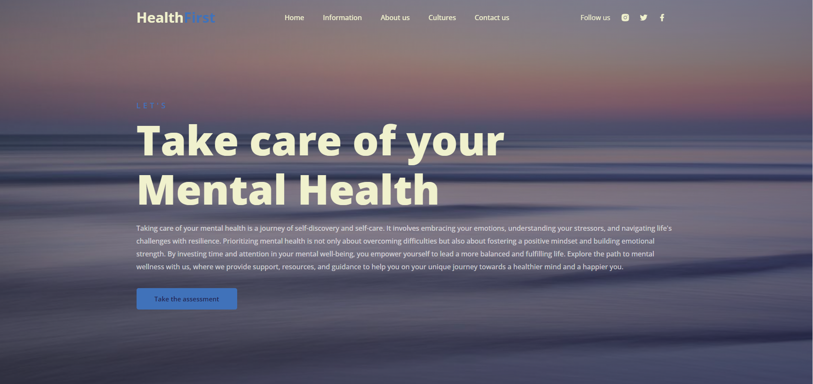

<h1>Health First</h1>
  

<h2>Project Deploy</h2>
 <a href="https://health-app-ashy.vercel.app/" target="_blank">Click here</a>
  
<h2>Description of the project</h2>

Health First is a web platform dedicated to promoting mental health awareness and providing resources for individuals seeking support and guidance. With a focus on destigmatizing mental health issues and fostering a supportive community, Health First offers valuable information, tools, and access to professional assistance.

<h3>Features:</h3>

<strong>Informative Content:</strong> Health First provides comprehensive information about various aspects of mental health, including common disorders, symptoms, treatment options, and self-care strategies. 
<strong>Assessment Tools:</strong> Users can access mental health assessment tests to evaluate their well-being and gain insights into their mental health status. 
<strong>Community Support:</strong> The platform facilitates community engagement through forums, support groups, and sharing personal stories, fostering a sense of belonging and reducing feelings of isolation. 
<strong>Professional Assistance:</strong> Users can connect with mental health professionals for counseling, therapy sessions, and expert guidance. 
<strong>Educational Resources:</strong> Health First offers a variety of educational resources, including articles, videos, and downloadable materials, to empower users with knowledge and skills to manage their mental health effectively. 
<strong>Events and Workshops:</strong> The platform hosts virtual events, workshops, and seminars conducted by mental health experts to educate and engage users in meaningful discussions. 
<strong>Mission Statement:</strong>
At Health First, our mission is to promote mental wellness, advocate for mental health awareness, and provide accessible resources and support to individuals on their journey to mental well-being. We believe in the power of education, community, and compassionate care to transform lives and create a world where mental health is prioritized and celebrated. 
<strong>Target Audience:</strong>
Health First caters to individuals of all ages who are interested in learning about mental health, seeking support for themselves or others, or contributing to mental health advocacy efforts. Our platform is inclusive and welcoming to people from diverse backgrounds and experiences.
 

<h2>Why i make this project?</h2>

I developed Health First out of a deep sense of responsibility and compassion for individuals struggling with mental health issues. Having witnessed the profound impact that mental health challenges can have on individuals and their loved ones, I felt compelled to create a platform that offers support, education, and empowerment.

<h2>How does this project work?</h2>

First aims to empower individuals to take proactive steps towards improving their mental health, provide them with the resources and support they need to navigate challenges, and contribute to a more inclusive and compassionate society that prioritizes mental well-being.

<h2>Tecnologies</h2>

HTML

CSS

JavaScript

<h2>Status</h2>

Finish.

<h2>Author</h2>

Lucas Landivar de Morais

